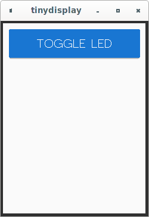
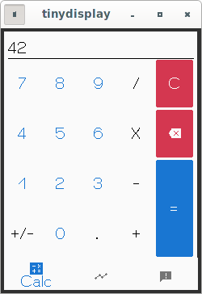
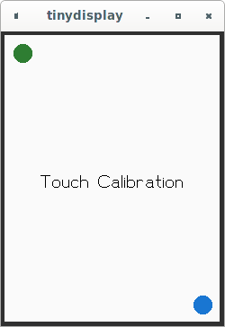
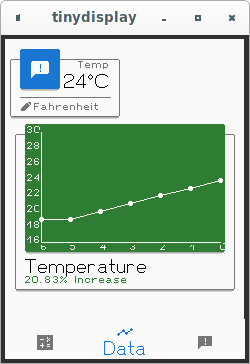
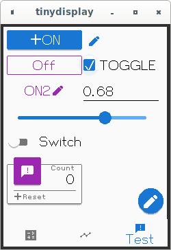

# Tiny Gui

A minimal material design based UI toolkit for Tiny Go projects.

**Warning: This library is in an alpha state there is currently no API stability guarantee.**

# Why

Microcontrollers have limited ram and flash storage a tyical UI toolkit will will require the construction of a component tree at run time that consumes ram. This component tree often includes both the structural definition of the UI and the state of the UI components. Through careful coding a component tree could be constructed as a compile time constant but such a UI would not be very dynamic.

# How

A Tiny Gui is instead created by rendering UI components in sequence programmatically in this way the component structure is guaranted to be in flash memory and through the usage of normal control flow statements (if,for) complex dynamic UIs can be constructed. This is often referred to as an immediate mode gui.

TinyGui additionaly performs zero allocations during rendering. The only memory usage is the stack during rendering and the minimal state for the components. When not actively rendering the only memory usage is the state of the components.

# Basic Example

This example will toggle an LED when a button is clicked.



```
package toggleled

import (
	"github.com/spearson78/tinygui"
	"github.com/spearson78/tinygui/component"

	"machine"
)

//State variable to track whether LED is on or off
var LedState bool

//State for Toggle Button
var btnToggleLed component.ButtonState

//Gui Function GuiContext is provided by Tiny Gui
func ToggleLedGui(g *tinygui.GuiContext) {

	//Create button props including default values based on current theme
	btnToggleProps := component.NewButtonProps(g)

	//Set position and Size of the button
	btnToggleProps.X = 10
	btnToggleProps.Y = 10
	btnToggleProps.W = 220
	btnToggleProps.H = 50

	//Set the label of the button
	btnToggleProps.Label = "TOGGLE LED"

	//Set the style of the button
	btnToggleProps.Style = component.Contained

	//Render the Button and handle the click
	if component.Button(g, &btnToggleLed, &btnToggleProps) {
		//component.Button returns true if the button was clicked
		LedState = !LedState
		machine.LED.Set(LedState)
	}
}
```

See the examples and cmd folders for more examples

# Screenshots










